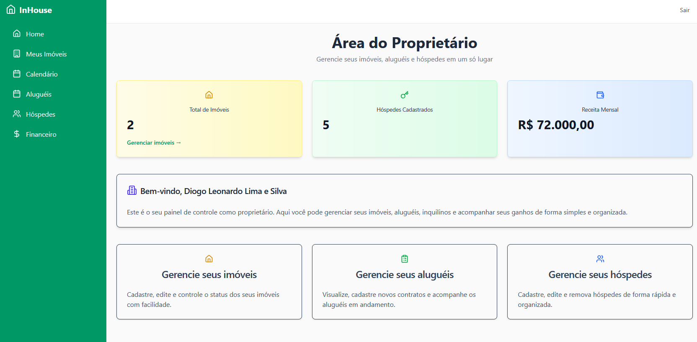
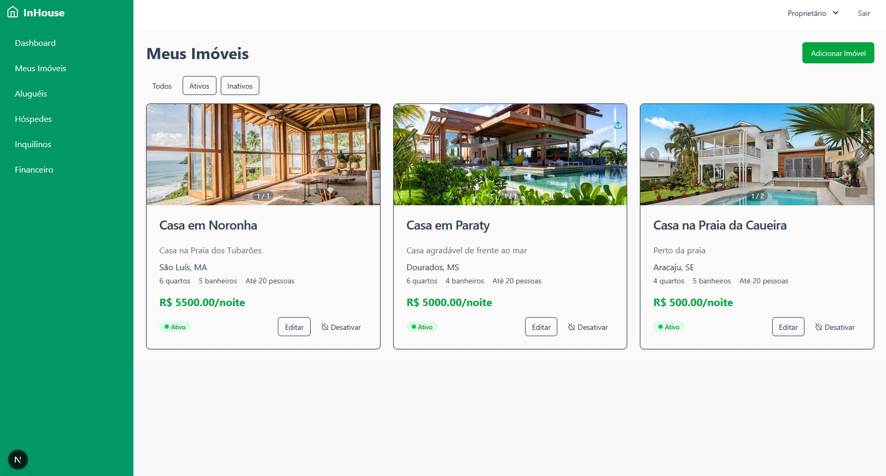
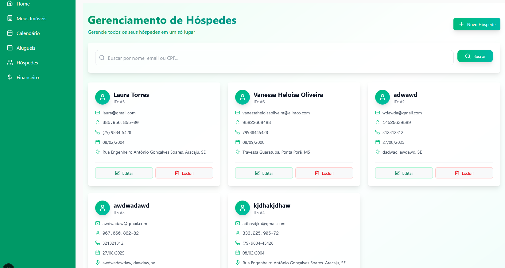
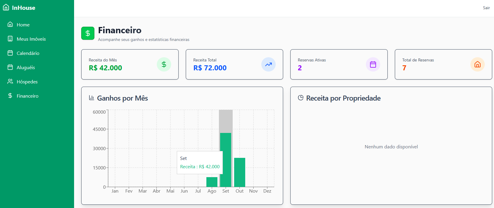

# InHouse - Sistema de Gerenciamento de Aluguéis

[](https://nextjs.org/)
[](https://react.dev/)
[](https://www.typescriptlang.org/)
[](https://tailwindcss.com/)

O InHouse é uma plataforma web completa para gerenciamento de imóveis e aluguéis, desenvolvida para proprietários que desejam administrar suas propriedades, reservas, hóspedes e finanças de forma simples e eficiente.

## 📋 Sumário

- [Visão Geral](#visão-geral)
- [Funcionalidades](#funcionalidades)
- [Tecnologias](#tecnologias)
- [Estrutura do Projeto](#estrutura-do-projeto)
- [Instalação e Execução](#instalação-e-execução)
- [API e Integração](#api-e-integração)
- [Autenticação e Autorização](#autenticação-e-autorização)
- [Layout e UI](#layout-e-ui)
- [Screenshots](#screenshots)
- [Contribuição](#contribuição)

## 🔍 Visão Geral

O InHouse é um sistema de gerenciamento de aluguéis que permite aos proprietários cadastrar imóveis, gerenciar reservas, acompanhar o faturamento e administrar informações de hóspedes. A plataforma oferece uma interface intuitiva e responsiva, desenvolvida com Next.js e React, fornecendo uma experiência de usuário moderna e eficiente.

## ✨ Funcionalidades

### Para Proprietários
- **Dashboard** - Visão geral de todas as métricas importantes
- **Gerenciamento de Imóveis** - Cadastro, edição e visualização de casas
- **Controle de Reservas e Aluguéis** - Gerenciamento completo de reservas
- **Calendário** - Visualização de disponibilidade dos imóveis
- **Gestão de Hóspedes** - Cadastro e histórico de hóspedes
- **Relatórios Financeiros** - Acompanhamento de faturamento e receitas

### Para Administradores
- **Painel Administrativo** - Gerenciamento completo da plataforma
- **Gestão de Usuários** - Controle de acesso e permissões

### Para Usuários
- **Autenticação** - Login e registro seguro
- **Perfil de Usuário** - Gerenciamento de informações pessoais

## 🚀 Tecnologias

### Frontend
- **Next.js 15.5.0** - Framework React com recursos de SSR e SSG
- **React 19.1.0** - Biblioteca para construção de interfaces
- **TypeScript** - Linguagem tipada para desenvolvimento escalável
- **TailwindCSS** - Framework CSS utilitário
- **Radix UI** - Componentes de interface acessíveis
- **React Hook Form** - Gerenciamento de formulários
- **Zod** - Validação de esquema
- **Axios** - Cliente HTTP para requisições à API
- **Next Auth** - Autenticação para aplicações Next.js
- **Recharts** - Biblioteca para criação de gráficos
- **Sonner** - Sistema de notificações
- **Date-fns** - Utilitário para manipulação de datas
- **Lucide React** - Biblioteca de ícones

## 📁 Estrutura do Projeto

```
src/
  app/                    # Estrutura de rotas do Next.js
    auth/                 # Páginas de autenticação
    proprietario/         # Dashboard e funcionalidades do proprietário
    admin/                # Painel administrativo
    api/                  # API routes e proxy
  components/             # Componentes reutilizáveis
    ui/                   # Componentes de interface
  lib/                    # Utilitários, serviços e tipos
```

## ⚙️ Instalação e Execução

### Pré-requisitos

- Node.js 18+
- NPM ou Yarn

### Instalação

1. Clone o repositório
```bash
git clone https://github.com/DiogoLeonardoo/gerenciamento-aluguel-front.git
cd gerenciamento-aluguel-front
```

2. Instale as dependências
```bash
npm install
# ou
yarn install
```

3. Configure as variáveis de ambiente
```
# .env.local
NEXT_PUBLIC_API_URL=http://localhost:8080
```

### Execução

```bash
# Desenvolvimento com Turbopack
npm run dev

# Build
npm run build

# Produção
npm run start
```

## 🔌 API e Integração

O frontend se comunica com uma API backend através de um proxy interno para evitar problemas de CORS. A integração é feita através de serviços organizados em:

- `authService` - Autenticação e gerenciamento de usuários
- `casasService` - Gerenciamento de imóveis
- `reservasService` - Gerenciamento de reservas e aluguéis
- `hospedesService` - Gerenciamento de hóspedes

## 🔒 Autenticação e Autorização

O sistema utiliza autenticação baseada em tokens JWT e possui diferentes níveis de acesso:
- **Administradores**: Acesso completo ao sistema
- **Proprietários**: Gerenciamento de seus imóveis e reservas
- **Usuários**: Acesso básico às funcionalidades de conta

## 🎨 Layout e UI

O layout da aplicação foi desenvolvido com foco na experiência do usuário, utilizando:
- **TailwindCSS** para estilização responsiva
- **Componentes reutilizáveis** para manter consistência visual
- **Design adaptativo** para diferentes dispositivos

## � Screenshots

### Dashboard


### Gerenciamento de Imóveis


### Gerenciamento de Hóspedes


### Relatórios Financeiros


## �👥 Contribuição

Para contribuir com o projeto:

1. Fork o repositório
2. Crie um branch para sua feature (`git checkout -b feature/nova-funcionalidade`)
3. Faça commit das alterações (`git commit -m 'Adiciona nova funcionalidade'`)
4. Push para o branch (`git push origin feature/nova-funcionalidade`)
5. Abra um Pull Request

---

Desenvolvido por [DiogoLeonardoo](https://github.com/DiogoLeonardoo) - © 2025 InHouse
